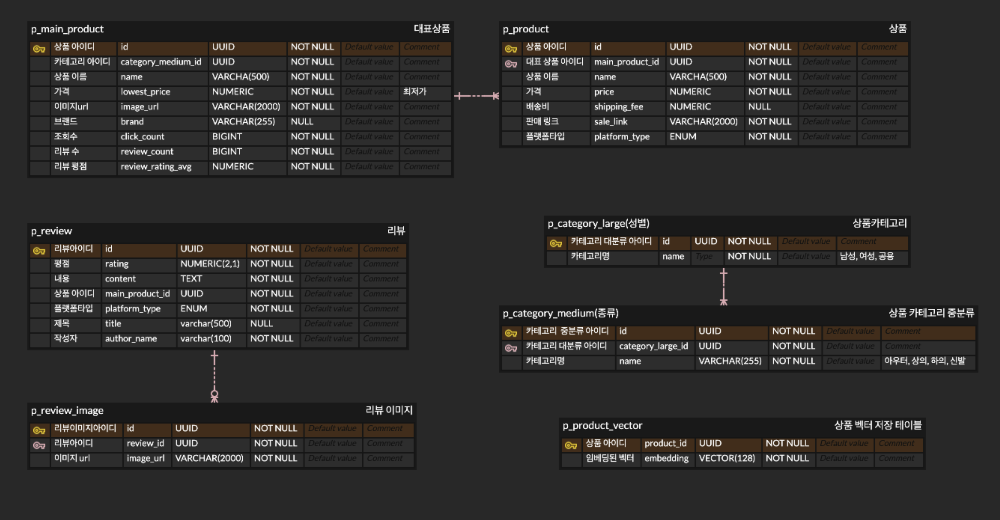
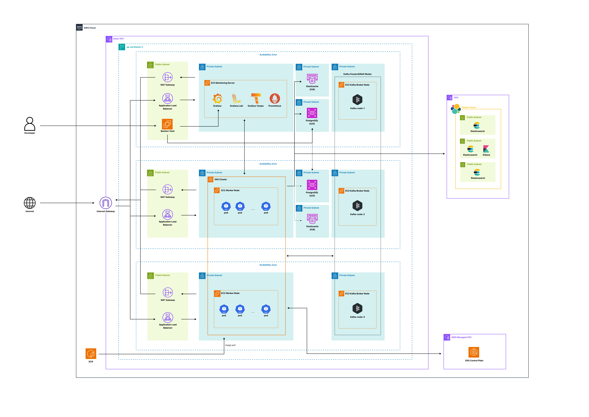
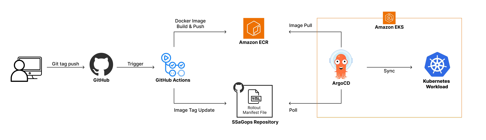
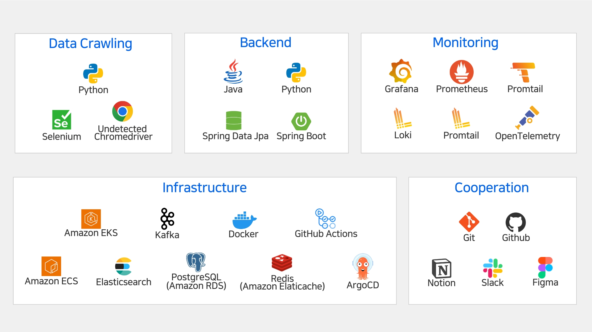

# 🛍️ SSaG B2C MSA Project
> 🏆 **2025 Java 단기심화 4기 부트캠프 우수 프로젝트 선정**

## 프로젝트 개요

- **프로젝트 목적**: 동일 상품의 실제 최저가를 직관적으로 비교할 수 있는 **패션 특화 가격 비교 플랫폼**을 구축하는 것을 목표로 합니다.

- **주요 기능**: 다중 쇼핑몰 상품 정보 크롤링, Elasticsearch 기반 고도화된 상품 검색, 사용자 행동 데이터를 활용한 상품 추천 기능 제공

- **개발 기간**: 2025/11/27 ~ 2025/12/24 **( 4 weeks )**

---

## 📌 프로젝트 목적 / 상세

### 1. 주제 선정 배경 및 기획 의도

#### 주제 선정 배경
기존 가격 비교 서비스는 전자제품이나 생활용품을 중심으로 설계되어 있어,
사이즈·컬러·시즌과 같은 패션 상품의 특수한 속성을 충분히 반영하지 못하고 있다.  
이로 인해 소비자는 동일한 패션 상품의 최저가를 확인하기 위해
여러 쇼핑몰을 반복적으로 탐색해야 하는 불편을 겪고 있다.

#### 기획 의도
패션 상품은 카테고리 특성상 전문화된 검색과 비교 기능이 필수적이다.  
본 프로젝트는 패션 상품의 사이즈·컬러·시즌 등의 속성을 고려하여
여러 쇼핑몰의 상품 정보를 수집·정규화하고,
동일 상품의 실제 최저가를 직관적으로 비교할 수 있는
**패션 특화 가격 비교 플랫폼**을 구축하는 것을 목표로 한다.

---

### 2. 프로젝트 구현 사항 및 컨셉

#### 구현 사항

##### 1) 다중 채널 상품 정보 수집
- 쿠팡, G마켓, 11번가, 옥션 등 다양한 판매 채널의 패션 상품 정보 자동 수집
- Python Selenium 기반 동적 크롤링을 통해 JavaScript 렌더링 콘텐츠(가격, 재고, 리뷰 등) 실시간 수집
- 크롤링 차단 우회 전략 적용
- 실구매가 기준 최저가 제공 및 채널별 가격 비교 화면 구성

##### 2) 사용자 경험 향상을 위한 고도화된 검색
- Elasticsearch 기반 검색 엔진 도입
- Nori Tokenizer 기반 자연어 검색을 통해  
  `검은색 오버핏 후드`와 같은 복합 검색어도 정확한 결과 제공

##### 3) 데이터 기반 상품 추천
- 사용자 클릭 데이터를 기반으로 상품 간 연관성 분석
- 협업 필터링(Collaborative Filtering)을 활용하여  
  “이 상품을 본 사용자가 함께 본 상품” 추천 기능 구현

#### 프로젝트 컨셉
확장 가능한 크롤러 구조를 기반으로
다양한 플랫폼의 패션 상품 정보를 수집·비교할 수 있는
**패션 특화 최저가 비교 플랫폼**

---

### 3. 학습 내용과의 연관성

- 대규모 크롤링 데이터를 안정적으로 처리하기 위해  
  Kafka 기반 메시지 큐를 활용한 MSA 구조를 적용하여  
  데이터 수집·처리 단계를 분리
- Prometheus 기반 메트릭 수집, Grafana 대시보드를 활용한 시각화,
  Loki를 통한 로그 수집 및 분석 등 모니터링 환경을 구축하여
  운영 관점의 학습 내용을 실제 프로젝트에 적용
- AWS 클라우드 환경에서 인프라를 구성하고
  비용을 고려한 운영을 수행하여 클라우드 및 인프라 관련 학습 내용과의 연관성 확보

---

### 4. 개발 환경

- 로컬 개발 및 운영 환경의 일관성을 유지하기 위해 Docker 기반 컨테이너 환경에서 개발
- 백엔드 서비스는 Java Spring Boot 기반으로 구현
- 대용량 데이터 처리를 위해 Kafka를 메시지 브로커로 활용
- 데이터 저장은 RDBMS와 Redis 캐시를 병행하여 성능 최적화
- 서비스 지표 및 메시지 처리 상태는 Prometheus와 Grafana를 통해 수집 및 시각화
- 개발 도구로 IntelliJ IDEA를 사용하며, 협업 및 형상 관리는 Git 기반으로 수행

---

### 5. 프로젝트 구조

#### 디렉토리 구조
- 서비스별 독립적인 디렉토리 구성으로 확장 가능성 확보
- 언어 및 기술 스택이 다른 서비스도 독립 배포 가능한 구조
- 마이크로서비스 아키텍처 기반 설계로 서비스 간 결합도 최소화

---

### 6. 활용 방안 및 기대 효과

#### 프로젝트 산출물의 기대 효과
- 여러 쇼핑몰에 분산된 상품 정보를 자동으로 수집·통합하여
  상품 정보와 최저가를 한눈에 제공
- 사용자는 개별 쇼핑몰을 직접 비교할 필요 없이
  빠르고 합리적인 구매 결정을 할 수 있음
- 추천 기능을 통해 사용자 행동 패턴이 반영된
  유사 상품 및 대체 상품을 함께 비교할 수 있어
  더 나은 소비 경험 제공

#### 비즈니스 실무 활용성
- 실제 커머스 서비스에서 요구되는  
  데이터 수집 → 처리 → 분석 → 추천의 전체 파이프라인을 반영
- 서비스 확장, 운영 모니터링, 장애 대응 측면에서
  실무에 즉시 활용 가능한 경험 제공

---

## 👥 팀원 역할 분담

| 이름   | 역할   | 담당 내용                                                 |
|------|------|-------------------------------------------------------|
| 강태성  | 팀장   | 크롤러 개발 및 고도화, 팀 의사소통 주도, 카프카 클러스터 구축, EKS 환경 구축       |
| 이나라힘 | 테크리더 | 상품서비스 개발 및 고도화, ES 검색 엔진 설계 및 구축, 기술 결정 주도, EKS 환경 구축 |
| 김민주  | 팀원   | 크롤러 개발 및 고도화, 모니터링 시스템 구축, EKS 환경 구축                  |
| 이수현  | 팀원   | 추천 서비스 개발 및 고도화, ETL 파이프라인 구축, 사용자 행동 분석 및 추천 모델 관리   |

---

## ⚙ 서비스 구성 및 실행 방법

### 설계 철학

- **DDD(Domain-Driven Design)** 기반 서비스 설계: 도메인 중심으로 계층과 책임을 명확히 구분
- **클린 아키텍처(Clean Architecture)** 적용: 의존성 규칙을 통해 Presentation, Application, Domain, Infrastructure 계층 분리  
  → 유지보수 용이, 테스트 용이성 확보

### 환경 설정 (Prerequisites)

- Java 17 이상
- Spring Boot 3.5.7 이상
- PostgreSQL 16 이상
- Gradle 8.14.3 이상

---

## 🗄️ ERD

---

## 🌐 시스템 아키텍쳐

---

## 🔁 CI/CD

---

## 🔑 API 주요 기능

### 🛒 상품
- **상품 검색**
    - 조건 기반 메인 상품 검색
    - 페이징 처리 지원
    - Elasticsearch 기반 검색
    - `POST /api/v1/products/search`

- **상품 상세 조회**
    - 메인 상품 단건 조회
    - 연관 상품 정보 함께 조회
    - `GET /api/v1/products/{mainProductId}`

- **메인 상품 생성**
    - 신규 메인 상품 등록
    - `POST /api/v1/products`

- **상품 데이터 동기화**
    - RDB → Elasticsearch 전체 데이터 동기화
    - `GET /api/v1/products/sync`

---

### 🗂 카테고리
- **카테고리 목록 조회**
    - 전체 대분류 카테고리 조회
    - `GET /api/v1/categories`

- **카테고리 상세 조회**
    - 중분류 카테고리 단건 조회
    - `GET /api/v1/categories/medium/{mediumCategoryId}`

---

### ⭐ 리뷰
- **리뷰 조회**
    - 메인 상품 기준 리뷰 목록 조회
    - 페이징 처리 지원
    - `GET /api/v1/reviews?mainProductId={UUID}`

---

### 🎯 추천
- **상품 추천 조회**
    - 상품 벡터 기반 추천 상품 목록 조회
    - Python 기반 벡터 연산 결과 활용
    - `GET /api/v1/recommendation/{productId}`

- **상품 벡터 갱신 (임시 API)**
    - 추천 모델 갱신을 위한 Python 코드 강제 실행
    - 스케줄러 대체용 (배포 시 제거 예정)
    - `GET /api/v1/recommendation/test`

---

### 📊 사용자 행동 분석 & 데이터 처리
- **사용자 이벤트 수집**
    - 사용자 행동 이벤트 수집 및 세션 단위 저장
    - `POST /api/v1/user-event`

- **ETL 작업 실행**
    - 사용자 이벤트 데이터 ETL 파이프라인 실행
    - `GET /api/v1/etl/run`

- **세션 클러스터링 실행**
    - Python 기반 K-Means 클러스터링 실행
    - `GET /api/v1/etl/kmeans`

- **세션 클러스터링 결과 수신**
    - 클러스터링 결과 저장
    - 이상치 세션 필터링 및 처리
    - `POST /api/v1/session-cluster`

# 🔧 기술 스택

